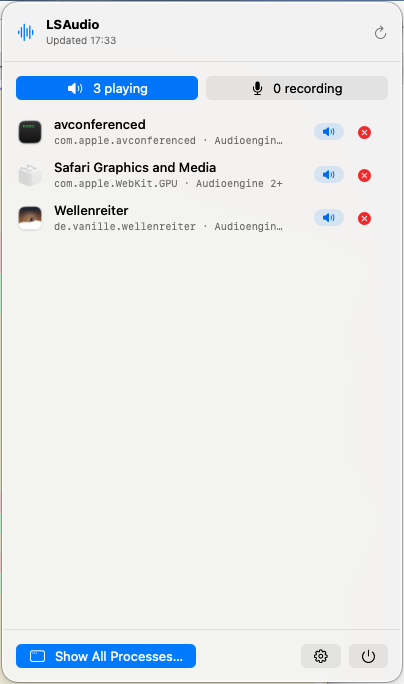

# lsaudio — List Audio Processes

A zero-dependency CLI for macOS that answers one question: **who is making
noise right now?** It lists every process that is currently playing or
recording audio — and can selectively kill the culprits.

The repository also contains **LSAudio for macOS**, a native macOS 26 menu-bar
app. It uses the same CoreAudio discovery and filtering module as the CLI and
provides its complete functionality through a professional SwiftUI interface.

## Motivation

It rattles, it dings, it pings. Modern systems (and, let's be honest,
LLM-powered coding agents) love to spawn processes that emit sound — a stray
`afplay` to "test" something, a forgotten `say`, a speech synthesizer, a
browser helper with an autoplaying tab — and then never clean up after
themselves. macOS offers no built-in way to see which processes are using
audio. `lsaudio` makes the invisible audible noise visible:

```
❯ lsaudio
┌───────┬───────────────────────────┬─────────────────────────────────┬─────┬────┬────────────────┐
│  PID  │          Process          │            Bundle ID            │ Out │ In │    Devices     │
├───────┼───────────────────────────┼─────────────────────────────────┼─────┼────┼────────────────┤
│ 41841 │ afplay                    │ —                               │ ▶   │ ·  │ Audioengine 2+ │
├───────┼───────────────────────────┼─────────────────────────────────┼─────┼────┼────────────────┤
│ 99075 │ corespeechd               │ com.apple.corespeechd           │ ▶   │ ·  │ Audioengine 2+ │
├───────┼───────────────────────────┼─────────────────────────────────┼─────┼────┼────────────────┤
│ 90963 │ Safari Graphics and Media │ com.apple.WebKit.GPU            │ ▶   │ ·  │ Audioengine 2+ │
├───────┼───────────────────────────┼─────────────────────────────────┼─────┼────┼────────────────┤
│ 99773 │ systemsoundserver-simd    │ systemsoundserver-simd          │ ▶   │ ·  │ Audioengine 2+ │
├───────┼───────────────────────────┼─────────────────────────────────┼─────┼────┼────────────────┤
│ 48981 │ Wellenreiter MenuBar      │ de.vanille.wellenreiter.menubar │ ▶   │ ·  │ Audioengine 2+ │
└───────┴───────────────────────────┴─────────────────────────────────┴─────┴────┴────────────────┘
```

…and lets you act on it:

```
❯ lsaudio kill afplay
  afplay, PID 41841 — playing
Send SIGTERM to 1 process? [y/N] y
Sent SIGTERM to afplay, PID 41841 — playing
```

Watch mode emits one event line per change when piped — handy for finding out
what just made that sound:

```
❯ lsaudio --watch --plain
2026-06-07T09:51:06Z  present  90963  Safari Graphics and Media  com.apple.WebKit.GPU  output
2026-06-07T09:51:06Z  present  99075  corespeechd                com.apple.corespeechd  output
2026-06-07T09:51:08Z  start    41947  afplay                     -                      output
2026-06-07T09:51:09Z  stop     41947  afplay                     -                      output
```

## Usage

```
lsaudio                  Processes currently playing or recording audio
lsaudio --all            Every process registered with coreaudiod, idle ones dimmed
lsaudio safari           Filter by name or bundle ID substring
lsaudio -x               Include executable paths — unmasks anonymous helpers
lsaudio --json           Machine-readable output
lsaudio --plain          Tab-separated output (automatic when piped)
lsaudio --watch          Live view; emits start/stop events when piped
lsaudio kill afplay      Send SIGTERM to active audio processes matching «afplay»
lsaudio kill             Make the noise stop: match every active audio process
lsaudio kill -s KILL 642 Send SIGKILL to PID 642
lsaudio kill -n music    Dry-run: only show what would be signalled
```

`kill` only matches *active* audio processes by default (pass `--all` to
include idle clients), prompts before sending a signal (`--force` skips,
`--no-input` fails instead — for scripts), and refuses to match its own
process. When a target belongs to another user (root-owned daemons like
`systemsoundserverd`), `lsaudio` offers to retry via `sudo` — or escalates
directly with `--sudo`. Exit codes: `0` success, `1` nothing matched, `2`
aborted, `3` a signal could not be delivered.

## How it works

`lsaudio` uses the CoreAudio process object API
(`kAudioHardwarePropertyProcessObjectList`, macOS 14+) to enumerate every
client registered with `coreaudiod` and queries each process object for its
PID, bundle ID, input/output running state, and the audio devices it uses.
No private APIs, no `pmset` heuristics, no polling — watch mode is driven by
CoreAudio property listeners.

Note that audio in browsers and Electron apps plays from a helper process
(e.g. `com.apple.WebKit.GPU` for Safari), not from the main app — `lsaudio`
shows the process that actually holds the audio session.

Two notorious indirections, learned the hard way:

- System sounds (notification plings, alerts) are *brokered*: apps ask
  `systemsoundserverd` to play them, so the audio session belongs to the
  daemon, not the noisy app.
- A `systemsoundserver-simd` whose executable path (see `-x`) lives under
  `/Library/Developer/CoreSimulator` is a **booted simulator** playing its
  notification sounds on your host audio. Killing it is futile — launchd
  respawns it. `xcrun simctl shutdown all` is your friend.

## Native macOS menu-bar app

The app lives in [`macOS/`](macOS/README.md) and performs an initial CoreAudio
scan as soon as it launches. Its menu-bar label shows the number of processes
playing and recording as `output·input`; CoreAudio property listeners keep the
label, popover, process table, and event history current without polling.

The compact panel separates playback and recording activity. The full process
window adds registered idle clients, search, executable paths, process details,
plain and JSON export, CLI-compatible watch events, and signal delivery by PID,
bundle ID, or name. Named and numeric signals, dry runs, all-active matching,
and administrator authorization for protected processes are supported.

<p align="center">
  
</p>

For local development, install XcodeGen and Shark, then use:

```bash
make mac-build
make mac-test
make mac-run
```

The interface follows the system Light or Dark appearance and uses only the
macOS system typeface.

## Installing

### Homebrew

```
brew tap mickeyl/formulae
brew install lsaudio
brew install --cask lsaudio-menubar
```

### Mint

```
mint install mickeyl/lsaudio
```

### From source

```
make install            # builds and installs to ~/.local (binary + man page)
make install PREFIX=/usr/local
```

Uninstall with `brew uninstall lsaudio`, `mint uninstall lsaudio`, or
`make uninstall` (same `PREFIX`), depending on how you installed.

## Requirements

- macOS 14 or later
- Swift toolchain (Xcode or Command Line Tools) to build

## License

MIT — see [LICENSE](LICENSE).
